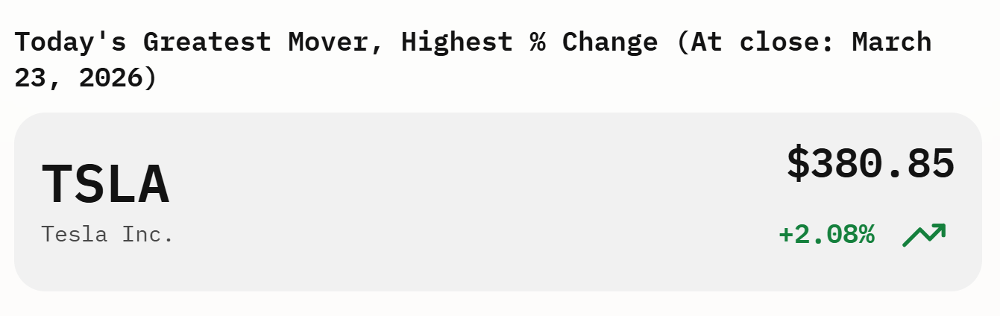

# Stocks Serverless Pipeline
This repository contains a serverless stock tracker built on AWS using CDK, Lambda, DynamoDB, API Gateway, and a Next.js frontend. It's purpose is to track greatest percent change of tracked stocks, each day.



Live Link [Stock Watchlist](https://main.d2o5xbreubwc5h.amplifyapp.com/)

## **Architecture**

- Infrastructure: AWS CDK (Python)
- Database: AWS DynamoDB
- Compute: AWS Lambda
- API: Amazon API Gateway
- Frontend: Next. js 14+ deployed via AWS Amplify

## **Prequisites**

- **AWS Account - IAM User**
- **AWS CLI** set to us-west-1
```
aws login
aws sts get-caller-identity
```
- **Node.js** (v18+ recommended)
- **Python** (3.11+ recommended)
- **npm** or **yarn**
- **CDK CLI**  
  ```
  npm install -g aws-cdk
  ```

---

## **Backend Deployment**
An API key from [Massive](Massive.com) is required. Store your Stock API Key in AWS Secrets Manager so the Lambda can access it securely.

```Bash
aws secretsmanager create-secret \
    --name MassiveApiKey \
    --description "Stock API Key" \
    --secret-string "YOUR_ACTUAL_API_KEY" \
    --region us-west-1
```
Now we can proceed to deploy infratructure.

### 1. Bootstrap your AWS environment
```
cd stocks-serverless-pipeline/cdk
cdk bootstrap
```

### 2. Set up Python virtual environment
```
python -m venv .venv

source .venv/Scripts/activate
```
### 3. Install dependencies
```
pip install -r requirements.txt
```
### 4. Run one-time python script to load history.
> Ensure to run from project root.
> Prerequisite: aws login
```
python scripts/backfill_history.py
```
### Deploy the CDK stack
```
cdk deploy
```
---

## **Frontend Deployment (Next.js)**

### 2.1. Configure API endpoint
Set the API Gateway URL as an environment variable for the frontend:

```
# In stocks-serverless-pipeline/frontend/.env.local
NEXT_PUBLIC_STOCK_API_BASE_URL=https://<your-api-id>.execute-api.<region>.amazonaws.com/prod
```
### 2.2. Install frontend dependencies
```
cd ../frontend
npm install
# or
yarn install
```

### 2.3. Run the frontend locally
```
npm run dev
# or
yarn dev
```

Visit [http://localhost:3000](http://localhost:3000) to view the app.

---